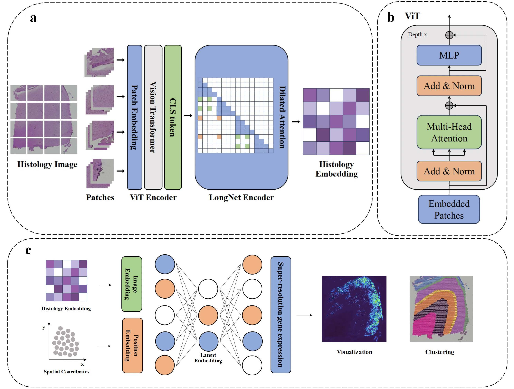

# TSRST

## TSRST: a LongNet Transformer model for imputing super-resolution spatial transcriptomics through histology and spatial context

### Model Overview

      

  *Overview of TSRST model architecture*

### Installations
- NVIDIA GPU (a single Nvidia GeForce RTX 4090D)
- `pip install -r requirements.txt`
